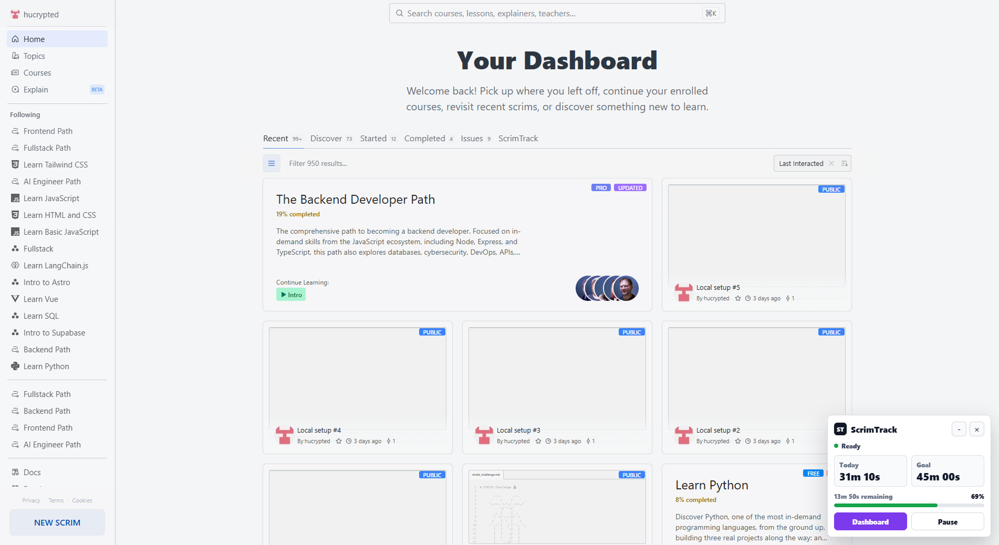
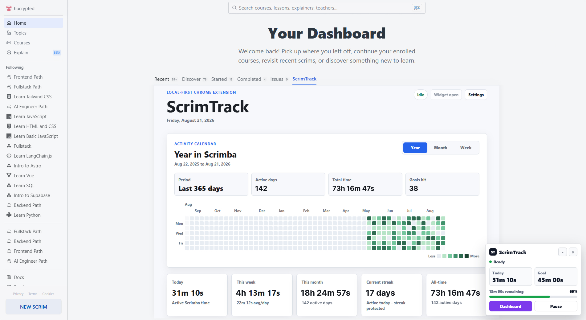
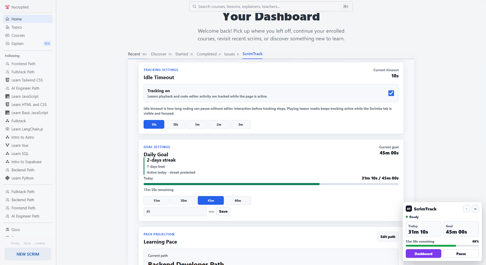
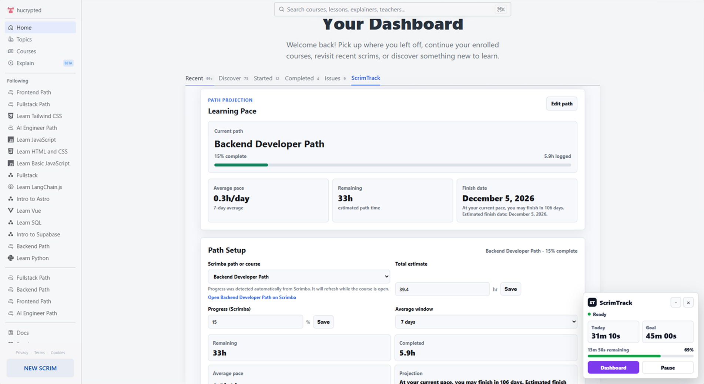
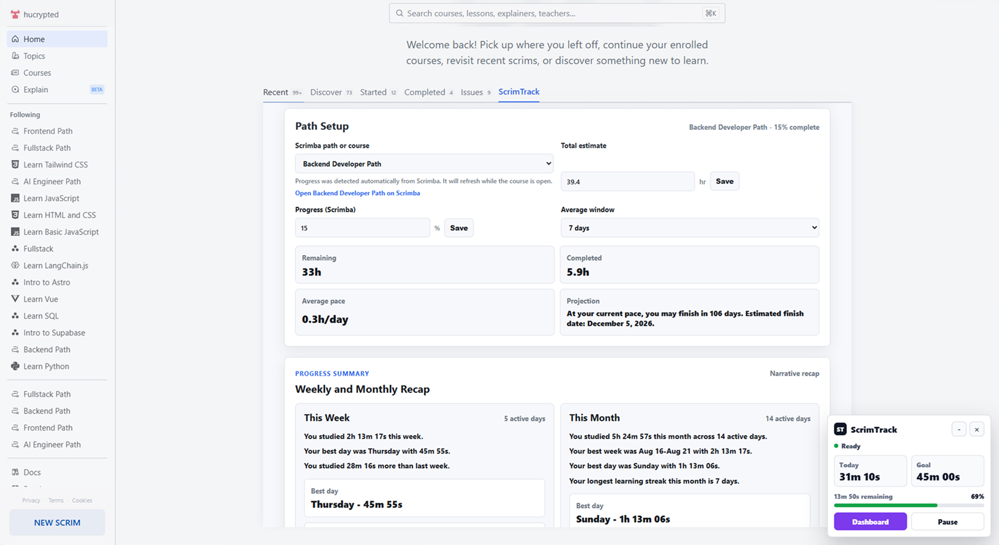
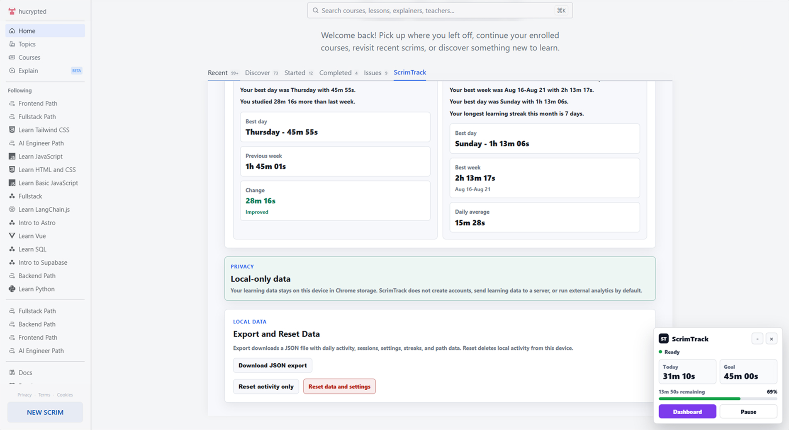

# ScrimTrack

ScrimTrack is an unofficial open-source Chrome extension for Scrimba learners who want a simple way to track focused learning time.

It tracks active Scrimba time, shows daily/weekly/monthly progress, builds streaks, displays a GitHub-style learning heatmap, and estimates your finish date based on your pace.

## Install

[](https://github.com/the-orbital-labs/scrimtrack/blob/main/LICENSE)

Install ScrimTrack from the Chrome Web Store:

[Add ScrimTrack to Chrome](https://chromewebstore.google.com/detail/scrimtrack/akjmadgnfokenilllgienlgedemaaidh)

See the [changelog](CHANGELOG.md) for release history and notable changes.

## What It Does

ScrimTrack helps you understand your Scrimba learning habits without accounts, syncing, or a backend server.

* Tracks active learning time only on supported Scrimba URLs
* Keeps tracking active while lesson media is playing in the visible, focused Scrimba tab
* Shows today, this week, this month, current streak, longest streak, and all-time totals
* Displays learning activity in a contribution-style heatmap
* Lets you set a daily learning goal
* Lets you select a Scrimba path or discovered course, sync visible progress,
  and estimate a finish date
* Exports local data as JSON and supports local reset controls

## Screenshots

| Scrimba integration | Embedded activity dashboard |
| --- | --- |
|  |  |

| Tracking and daily goals | Path progress and projection |
| --- | --- |
|  |  |

| Path setup and progress recaps | Privacy and local data |
| --- | --- |
|  |  |

## Privacy

ScrimTrack is privacy-friendly by default.

* Learning data stays on your device in `chrome.storage.local`.
* ScrimTrack does not require accounts or authentication.
* ScrimTrack does not send learning data to a backend server.
* External analytics are not enabled by default.
* ScrimTrack only tracks activity on supported Scrimba URLs.

## Permissions

ScrimTrack requests limited permissions:

* `storage` is used to save activity, sessions, streaks, settings, selected
  courses, detected progress, and path projection data locally.
* Scrimba host access is limited to:

  * `https://scrimba.com/*`
  * `https://v2.scrimba.com/*`

ScrimTrack does **not** request access to:

* browsing history
* tabs
* bookmarks
* cookies
* `webRequest`
* `browsingData`
* `<all_urls>`

## Roadmap

ScrimTrack is built milestone by milestone, with a focus on simple local-first tracking for Scrimba learners.

Planned improvements include:

* Improve the embedded dashboard and floating tracker's usability
* Make daily goals, streaks, and progress summaries easier to understand
* Polish the contribution heatmap and finish-date projection experience
* Improve accessibility and extension UI consistency

ScrimTrack will stay local-first and focused on Scrimba learning. Backend services, accounts, AI features, and social features are not part of the roadmap.

## Feedback and Contributions

Feedback, bug reports, and focused contributions are welcome.

See [CONTRIBUTING.md](CONTRIBUTING.md) for the complete contribution workflow.
All project participation is governed by the
[Code of Conduct](CODE_OF_CONDUCT.md). Report suspected vulnerabilities
privately by following the [Security Policy](SECURITY.md).

Good issues or pull requests include:

* Bugs in Scrimba time tracking
* Incorrect daily, weekly, monthly, streak, or heatmap calculations
* UI or accessibility improvements
* Documentation fixes
* Small improvements that support the roadmap above

Before contributing:

* Keep the extension local-first.
* Track only `https://scrimba.com/*` and `https://v2.scrimba.com/*`.
* Keep Chrome permissions minimal.
* Avoid unrelated features, backend services, authentication, AI features, and social features.
* Run `npm run build` before opening a pull request.

## Local Development

To build and install ScrimTrack locally:

```bash
git clone https://github.com/the-orbital-labs/scrimtrack.git
cd scrimtrack
npm ci
npm run build
```

Then open `chrome://extensions` in Chrome, enable **Developer mode**, choose
**Load unpacked**, and select the generated `dist` directory.

Run `npm run build` again after making changes, then reload the extension from
`chrome://extensions`.

## Disclaimer

ScrimTrack is an unofficial project and is not affiliated with, endorsed by, or sponsored by Scrimba.

## License

ScrimTrack is released under the [MIT License](LICENSE).
